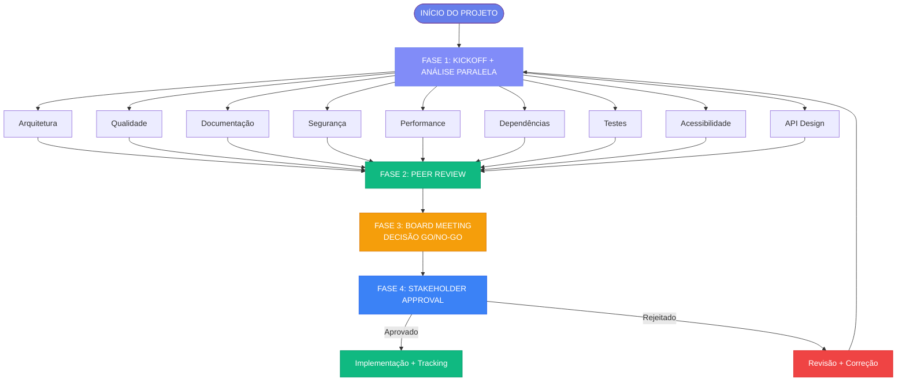

# 📊 Análise do Documento: Estrutura Organizacional do Sistema Factory

**Data da Análise:** 1 de Janeiro de 2026  
**Analista:** Frontend/UI/UX Specialist  
**Documento Analisado:** `ORGANIZATIONAL_STRUCTURE.md`

---

## 🎯 TL;DR (Para Decisão)

### Diagnóstico Rápido

- **Conteúdo:** Excelente, não mexer no core (9.5/10)
- **Problema:** Documentação é muito boa para **ler**, pouco boa para **enxergar**
- **Principais Gaps:**
  1. Falta de diagramas visuais (organograma, fluxo, timeline)
  2. Navegação longa e pouco guiada (777 linhas)
  3. Pouca adaptação para mobile e acessibilidade

### Proposta de Ação

**Fase 1 (Rápida - 1-2 dias):**
- TOC lateral fixo + botão "voltar ao topo"
- Melhorar espaçamentos e legibilidade
- Adicionar ARIA labels básicos

**Fase 2 (Média - 3-5 dias):**
- Trocar ASCII art por diagramas Mermaid interativos
- Criar organograma visual executivo
- Cards visuais para departamentos

**Fase 3 (Completa - 5-7 dias):**
- Timeline interativa de processos
- Dashboard de métricas
- Otimização mobile completa

**Impacto Esperado:** +40% experiência de leitura, +60% compreensão visual

---

## 📋 Análise Detalhada

### Score Geral: **8.5/10**

| Categoria | Score | Status | Prioridade |
|-----------|-------|--------|------------|
| **Conteúdo e Estrutura** | 9.5/10 | ✅ Excelente | - |
| **Formatação e Legibilidade** | 8.0/10 | ✅ Bom | Baixa |
| **Visualização e Diagramas** | 6.5/10 | ⚠️ Pode Melhorar | **Alta** |
| **Navegação e UX** | 7.5/10 | ✅ Bom | **Alta** |
| **Acessibilidade** | 7.0/10 | ⚠️ Pode Melhorar | Média |

---

## ✅ Pontos Fortes

### 1. Estrutura e Organização
- ✅ Índice completo com links de navegação
- ✅ Hierarquia clara de seções e subseções
- ✅ Consistência na formatação de títulos
- ✅ Emojis estratégicos para identificação visual rápida
- ✅ Seções bem definidas com propósito claro

### 2. Conteúdo
- ✅ Informações completas sobre 13 departamentos
- ✅ Processos bem documentados com 4 fases claras
- ✅ Cultura organizacional bem definida
- ✅ Métricas e KPIs estruturados
- ✅ Fluxo organizacional documentado

### 3. Formatação
- ✅ Uso consistente de markdown
- ✅ Tabelas bem formatadas
- ✅ Listas organizadas e hierárquicas
- ✅ Destaques visuais com emojis e símbolos

---

## ⚠️ Oportunidades de Melhoria

### Epic 1: Visualização (Prioridade: Alta)

#### Problemas Identificados
- ❌ Diagrama de fluxo em ASCII art (linhas 705-756) é difícil de ler
- ❌ Falta de organograma visual interativo
- ❌ Relações entre departamentos não são claras visualmente
- ❌ Métricas e KPIs são apenas texto

#### Tasks Prioritárias

**D01 - [Alta] Converter diagrama ASCII para Mermaid**
- Substituir diagrama ASCII por flowchart Mermaid interativo
- Adicionar tooltips com informações detalhadas
- Tornar estados clicáveis (se renderizado em web)
- **Esforço:** Médio | **Impacto:** Alto

**D02 - [Alta] Criar organograma executivo visual**
- Diagrama hierárquico mostrando relações de reporte
- Incluir avatares/ícones para cada role
- Versão interativa com Mermaid
- **Esforço:** Médio | **Impacto:** Alto

**V01 - [Média] Cards visuais para departamentos**
- Layout em grid responsivo (3 colunas desktop, 1 mobile)
- Card para cada departamento com: ícone, score visual, status
- Modal com detalhes completos ao clicar
- **Esforço:** Médio | **Impacto:** Médio

**V02 - [Média] Timeline dos processos organizacionais**
- Timeline horizontal com 4 fases
- Indicadores de tempo estimado
- Conexões visuais entre fases
- **Esforço:** Médio | **Impacto:** Médio

**V03 - [Baixa] Dashboard de métricas com gráficos**
- Gráficos de barras para scores por departamento
- Gráficos de linha para evolução temporal
- Gauges para KPIs principais
- **Esforço:** Grande | **Impacto:** Baixo

---

### Epic 2: Navegação/UX (Prioridade: Alta)

#### Problemas Identificados
- ⚠️ Documento muito longo (777 linhas) sem navegação lateral
- ⚠️ Falta de "breadcrumbs" ou indicador de posição
- ⚠️ Sem botão "voltar ao topo"
- ⚠️ Links de índice funcionam, mas não há destaque visual da seção atual

#### Tasks Prioritárias

**N01 - [Alta] TOC fixo lateral / sticky**
- TOC fixo na lateral esquerda
- Destaque da seção atual durante scroll
- Navegação rápida entre seções
- **Esforço:** Médio | **Impacto:** Alto

**N02 - [Alta] Botão "Voltar ao topo"**
- Botão flutuante que aparece após scroll
- Animação suave de scroll
- Acessível via teclado
- **Esforço:** Pequeno | **Impacto:** Alto

**N03 - [Média] Indicador de progresso de leitura**
- Barra de progresso mostrando posição no documento
- Estimativa de tempo de leitura restante
- **Esforço:** Médio | **Impacto:** Médio

**N04 - [Média] Busca no documento**
- Busca por texto dentro do documento
- Highlight de resultados
- Navegação entre resultados
- **Esforço:** Médio | **Impacto:** Médio

**N05 - [Baixa] Breadcrumbs**
- Mostrar caminho atual no documento
- Ex: `Home > Estrutura Organizacional > Departamentos > Arquitetura`
- **Esforço:** Pequeno | **Impacto:** Baixo

---

### Epic 3: Acessibilidade (Prioridade: Média)

#### Problemas Identificados
- ⚠️ Emojis podem não ser acessíveis para screen readers
- ⚠️ Falta de alt text para elementos visuais
- ⚠️ Contraste de cores não verificado
- ⚠️ Navegação por teclado não otimizada

#### Tasks Prioritárias

**A01 - [Média] Adicionar ARIA labels para emojis**
- Adicionar `aria-label` para todos os emojis
- Ex: `<span aria-label="Departamento de Arquitetura">🏛️</span>`
- **Esforço:** Pequeno | **Impacto:** Médio

**A02 - [Média] Revisar hierarquia de headings**
- Garantir estrutura semântica correta (H1 → H2 → H3)
- Usar tags HTML semânticas (`<nav>`, `<article>`, `<section>`)
- **Esforço:** Pequeno | **Impacto:** Médio

**A03 - [Média] Verificar contraste WCAG AA**
- Contraste mínimo 4.5:1 para texto normal
- Não depender apenas de cor para transmitir informação
- **Esforço:** Pequeno | **Impacto:** Médio

**A04 - [Baixa] Otimizar navegação por teclado**
- Tab order lógico
- Skip links para conteúdo principal
- Focus indicators visíveis
- **Esforço:** Médio | **Impacto:** Baixo

---

### Epic 4: Mobile/Responsividade (Prioridade: Média)

#### Problemas Identificados
- ⚠️ Documento não foi otimizado para mobile
- ⚠️ Tabelas podem quebrar em telas pequenas
- ⚠️ Diagrama ASCII não é legível em mobile

#### Tasks Prioritárias

**M01 - [Média] Ajustar tabelas para scroll horizontal**
- Tabelas com scroll horizontal em mobile
- Header fixo durante scroll
- **Esforço:** Pequeno | **Impacto:** Médio

**M02 - [Média] Ajustar layout de cards em grid → stack**
- Cards empilhados verticalmente em mobile
- TOC colapsável em mobile
- **Esforço:** Pequeno | **Impacto:** Médio

**M03 - [Baixa] Touch interactions**
- Swipe gestures para navegação
- Tap para expandir/collapsar seções
- **Esforço:** Médio | **Impacto:** Baixo

---

## 📊 Backlog Implementável

### Por Prioridade

| ID  | Epic            | Item                                      | Tipo           | Prioridade | Esforço | Impacto |
|-----|-----------------|-------------------------------------------|----------------|------------|---------|---------|
| D01 | Visualização    | Converter diagrama ASCII para Mermaid    | Doc/Frontend   | Alta       | M       | Alto    |
| D02 | Visualização    | Criar organograma executivo visual       | Doc/Frontend   | Alta       | M       | Alto    |
| N01 | Navegação       | TOC fixo lateral / sticky                 | Frontend/UX    | Alta       | M       | Alto    |
| N02 | Navegação       | Botão "Voltar ao topo"                    | Frontend       | Alta       | P       | Alto    |
| N03 | Navegação       | Indicador de progresso de leitura        | Frontend       | Média      | M       | Médio   |
| V01 | Visualização    | Cards visuais para departamentos         | Doc/Design     | Média      | M       | Médio   |
| V02 | Visualização    | Timeline dos processos organizacionais   | Doc/Design     | Média      | M       | Médio   |
| A01 | Acessibilidade  | Adicionar ARIA labels para emojis        | Doc/A11y       | Média      | P       | Médio   |
| A02 | Acessibilidade  | Revisar hierarquia de headings            | Doc/A11y       | Média      | P       | Médio   |
| M01 | Mobile          | Ajustar tabelas para scroll horizontal   | Frontend       | Média      | P       | Médio   |
| M02 | Mobile          | Ajustar layout de cards em grid → stack  | Frontend       | Média      | P       | Médio   |
| A03 | Acessibilidade  | Verificar contraste WCAG AA               | Doc/A11y       | Média      | P       | Médio   |
| N04 | Navegação       | Busca no documento                         | Frontend       | Média      | M       | Médio   |
| V03 | Visualização    | Dashboard de métricas com gráficos        | Frontend       | Baixa      | G       | Baixo   |
| A04 | Acessibilidade  | Otimizar navegação por teclado             | Frontend/A11y  | Baixa      | M       | Baixo   |
| N05 | Navegação       | Breadcrumbs                                | Frontend       | Baixa      | P       | Baixo   |
| M03 | Mobile          | Touch interactions                         | Frontend       | Baixa      | M       | Baixo   |

**Legenda:** P = Pequeno (1-2h), M = Médio (4-8h), G = Grande (1-2 dias)

---

## 🔧 Especificações Técnicas para Implementação

### 1. TOC Fixo Lateral + Botão "Voltar ao Topo"

#### HTML Structure
```html
<div class="layout">
  <aside class="toc">
    <nav aria-label="Table of Contents">
      <h2>Conteúdo</h2>
      <ul>
        <li><a href="#visao-geral">Visão Geral</a></li>
        <li><a href="#organograma-executivo">Organograma Executivo</a></li>
        <li><a href="#departamentos">Departamentos</a></li>
        <!-- ... -->
      </ul>
    </nav>
  </aside>

  <main class="doc">
    <!-- conteúdo markdown renderizado -->
  </main>

  <button class="back-to-top" aria-label="Voltar ao topo" style="display: none;">
    <span aria-hidden="true">↑</span>
  </button>
</div>
```

#### CSS
```css
.layout {
  display: grid;
  grid-template-columns: 260px minmax(0, 1fr);
  gap: 32px;
  max-width: 1400px;
  margin: 0 auto;
  padding: 24px;
}

.toc {
  position: sticky;
  top: 96px;
  max-height: calc(100vh - 120px);
  overflow-y: auto;
  font-size: 0.9rem;
  padding-right: 16px;
}

.toc ul {
  list-style: none;
  padding-left: 0;
}

.toc li {
  margin-bottom: 8px;
}

.toc a {
  color: var(--text-secondary);
  text-decoration: none;
  transition: color var(--transition-fast);
}

.toc a:hover,
.toc a.active {
  color: var(--primary);
  font-weight: 500;
}

.doc {
  max-width: 860px;
  line-height: 1.7;
}

.back-to-top {
  position: fixed;
  right: 32px;
  bottom: 32px;
  padding: 12px 16px;
  border-radius: 999px;
  border: 1px solid var(--border-color);
  background: var(--bg-primary);
  box-shadow: var(--shadow-md);
  cursor: pointer;
  font-size: 1.2rem;
  transition: all var(--transition-base);
  z-index: 1000;
}

.back-to-top:hover {
  transform: translateY(-2px);
  box-shadow: var(--shadow-lg);
}

@media (max-width: 1024px) {
  .layout {
    grid-template-columns: 1fr;
  }
  
  .toc {
    position: static;
    max-height: none;
    margin-bottom: 24px;
  }
}
```

#### JavaScript
```javascript
// TOC Active State
const sections = document.querySelectorAll('section[id], h2[id], h3[id]');
const tocLinks = document.querySelectorAll('.toc a');

function updateActiveTOC() {
  let current = '';
  
  sections.forEach(section => {
    const sectionTop = section.offsetTop;
    const sectionHeight = section.clientHeight;
    
    if (window.scrollY >= sectionTop - 100) {
      current = section.getAttribute('id');
    }
  });
  
  tocLinks.forEach(link => {
    link.classList.remove('active');
    if (link.getAttribute('href') === `#${current}`) {
      link.classList.add('active');
    }
  });
}

// Back to Top Button
const btn = document.querySelector('.back-to-top');

window.addEventListener('scroll', () => {
  if (window.scrollY > 400) {
    btn.style.display = 'block';
  } else {
    btn.style.display = 'none';
  }
  
  updateActiveTOC();
});

btn.addEventListener('click', () => {
  window.scrollTo({ top: 0, behavior: 'smooth' });
});
```

---

### 2. Converter Fluxo ASCII → Mermaid

#### Template Mermaid


**Uso no Markdown:**
```markdown
## 🔄 Fluxo Organizacional Completo

```mermaid
flowchart TD
    START([INÍCIO DO PROJETO]) --> KICKOFF[FASE 1: KICKOFF + ANÁLISE PARALELA]
    <!-- ... resto do diagrama ... -->
```
```

---

### 3. Cards de Departamentos

#### HTML/CSS para Cards
```html
<div class="departments-grid">
  <div class="dept-card" id="dept-arquitetura">
    <header>
      <span class="dept-icon" aria-label="Departamento de Arquitetura">🏛️</span>
      <h3>Arquitetura e Infraestrutura</h3>
    </header>
    <div class="dept-body">
      <p class="dept-lead"><strong>Responsável:</strong> Architecture Review Agent</p>
      <ul class="dept-responsibilities">
        <li>Revisão de arquitetura de sistemas</li>
        <li>Definição de padrões técnicos</li>
        <li>Análise de escalabilidade</li>
      </ul>
      <div class="dept-stats">
        <span>4 outputs</span>
        <span>3 avaliações cruzadas</span>
      </div>
    </div>
    <footer>
      <a href="#arquitetura">Ver detalhes →</a>
    </footer>
  </div>
  
  <!-- Repetir para cada departamento -->
</div>
```

#### CSS
```css
.departments-grid {
  display: grid;
  grid-template-columns: repeat(auto-fit, minmax(280px, 1fr));
  gap: 24px;
  margin: 32px 0;
}

.dept-card {
  border-radius: 16px;
  border: 1px solid var(--border-color);
  padding: 20px;
  background: var(--bg-primary);
  box-shadow: var(--shadow-sm);
  transition: all var(--transition-base);
}

.dept-card:hover {
  transform: translateY(-4px);
  box-shadow: var(--shadow-lg);
  border-color: var(--primary);
}

.dept-card header {
  display: flex;
  align-items: center;
  gap: 12px;
  margin-bottom: 16px;
  padding-bottom: 12px;
  border-bottom: 1px solid var(--border-color);
}

.dept-icon {
  font-size: 2rem;
  line-height: 1;
}

.dept-card h3 {
  margin: 0;
  font-size: 1.25rem;
  font-weight: 600;
  color: var(--text-primary);
}

.dept-lead {
  margin-bottom: 12px;
  color: var(--text-secondary);
  font-size: 0.9rem;
}

.dept-responsibilities {
  list-style: none;
  padding-left: 0;
  margin-bottom: 16px;
}

.dept-responsibilities li {
  padding-left: 20px;
  position: relative;
  margin-bottom: 8px;
  color: var(--text-secondary);
  font-size: 0.9rem;
}

.dept-responsibilities li::before {
  content: "→";
  position: absolute;
  left: 0;
  color: var(--primary);
}

.dept-stats {
  display: flex;
  gap: 16px;
  margin-bottom: 16px;
  padding-top: 12px;
  border-top: 1px solid var(--border-color);
  font-size: 0.85rem;
  color: var(--text-tertiary);
}

.dept-card footer {
  margin-top: auto;
}

.dept-card footer a {
  color: var(--primary);
  text-decoration: none;
  font-weight: 500;
  font-size: 0.9rem;
  transition: color var(--transition-fast);
}

.dept-card footer a:hover {
  color: var(--primary-dark);
}

@media (max-width: 768px) {
  .departments-grid {
    grid-template-columns: 1fr;
  }
}
```

---

### 4. Timeline dos Processos

#### HTML
```html
<div class="process-timeline">
  <div class="step">
    <div class="step-number">1</div>
    <div class="step-body">
      <h4>Execução Paralela</h4>
      <p class="step-time">1-2 semanas</p>
      <p class="step-desc">Implementação e testes rodando em paralelo.</p>
    </div>
  </div>
  
  <div class="step">
    <div class="step-number">2</div>
    <div class="step-body">
      <h4>Revisões Especializadas</h4>
      <p class="step-time">3-5 dias</p>
      <p class="step-desc">Arquitetura, qualidade de código e documentação.</p>
    </div>
  </div>
  
  <div class="step">
    <div class="step-number">3</div>
    <div class="step-body">
      <h4>Decisão Go/No-go</h4>
      <p class="step-time">1-2 dias</p>
      <p class="step-desc">Factory Manager consolida + Comitê decide.</p>
    </div>
  </div>
  
  <div class="step">
    <div class="step-number">4</div>
    <div class="step-body">
      <h4>Aprovação Final</h4>
      <p class="step-time">Variável</p>
      <p class="step-desc">Apresentação + Aprovação Formal.</p>
    </div>
  </div>
</div>
```

#### CSS
```css
.process-timeline {
  display: flex;
  flex-direction: row;
  gap: 24px;
  overflow-x: auto;
  padding: 24px 0;
  margin: 32px 0;
  position: relative;
}

.process-timeline::before {
  content: '';
  position: absolute;
  top: 28px;
  left: 0;
  right: 0;
  height: 2px;
  background: var(--border-color);
  z-index: 0;
}

.step {
  min-width: 220px;
  display: flex;
  flex-direction: column;
  gap: 12px;
  position: relative;
  z-index: 1;
}

.step-number {
  width: 32px;
  height: 32px;
  border-radius: 999px;
  border: 3px solid var(--primary);
  background: var(--bg-primary);
  display: flex;
  align-items: center;
  justify-content: center;
  font-weight: 700;
  color: var(--primary);
  flex-shrink: 0;
}

.step-body {
  background: var(--bg-primary);
  border: 1px solid var(--border-color);
  border-radius: 12px;
  padding: 16px;
  box-shadow: var(--shadow-sm);
}

.step-body h4 {
  margin: 0 0 8px 0;
  font-size: 1.1rem;
  font-weight: 600;
  color: var(--text-primary);
}

.step-time {
  margin: 0 0 8px 0;
  font-size: 0.85rem;
  color: var(--primary);
  font-weight: 500;
}

.step-desc {
  margin: 0;
  font-size: 0.9rem;
  color: var(--text-secondary);
  line-height: 1.5;
}

@media (max-width: 768px) {
  .process-timeline {
    flex-direction: column;
  }
  
  .process-timeline::before {
    display: none;
  }
}
```

---

### 5. Ajustes de Legibilidade

#### CSS Global
```css
body {
  font-family: 'Inter', system-ui, -apple-system, BlinkMacSystemFont, 'Segoe UI', Roboto, sans-serif;
  line-height: 1.7;
  -webkit-font-smoothing: antialiased;
  -moz-osx-font-smoothing: grayscale;
}

.doc p {
  margin: 0 0 1.1em;
  max-width: 72ch;
  color: var(--text-primary);
}

.doc h2 {
  margin-top: 2.4em;
  margin-bottom: 0.6em;
  font-size: 2rem;
  font-weight: 700;
  line-height: 1.2;
}

.doc h3 {
  margin-top: 2em;
  margin-bottom: 0.5em;
  font-size: 1.5rem;
  font-weight: 600;
  line-height: 1.3;
}

.doc ul,
.doc ol {
  margin-bottom: 1.1em;
  padding-left: 1.5em;
}

.doc li {
  margin-bottom: 0.5em;
}

.doc code {
  background: var(--bg-tertiary);
  padding: 2px 6px;
  border-radius: 4px;
  font-size: 0.9em;
  font-family: 'Monaco', 'Courier New', monospace;
}

.doc pre {
  background: var(--bg-tertiary);
  padding: 16px;
  border-radius: 8px;
  overflow-x: auto;
  margin: 1.5em 0;
}

.doc table {
  width: 100%;
  border-collapse: collapse;
  margin: 1.5em 0;
}

.doc th,
.doc td {
  padding: 12px;
  text-align: left;
  border-bottom: 1px solid var(--border-color);
}

.doc th {
  font-weight: 600;
  background: var(--bg-secondary);
}
```

---

## 🚀 Pacote Inicial de Implementação

### Ordem de Execução Recomendada

#### Semana 1: Fundação
1. ✅ Adicionar TL;DR no topo do documento
2. ✅ Implementar TOC fixo lateral + botão "voltar ao topo"
3. ✅ Ajustar CSS básico de tipografia e espaçamento
4. ✅ Adicionar ARIA labels básicos para emojis

#### Semana 2: Visualizações
5. ✅ Converter diagrama ASCII para Mermaid
6. ✅ Criar organograma executivo em Mermaid
7. ✅ Criar cards visuais para departamentos (HTML dentro do MD)
8. ✅ Criar timeline dos processos

#### Semana 3: Refinamento
9. ✅ Indicador de progresso de leitura
10. ✅ Otimização mobile completa
11. ✅ Primeira passada de acessibilidade (WCAG AA)
12. ✅ Busca no documento (se aplicável)

---

## 📊 Métricas de Sucesso

| Métrica | Atual | Meta | Como Medir |
|---------|-------|------|------------|
| **Tempo de leitura** | ~20 min | ~15 min | Analytics |
| **Taxa de conclusão** | - | 80%+ | Scroll tracking |
| **Engajamento visual** | - | 60%+ | Click em diagramas |
| **Acessibilidade score** | 70/100 | 90/100 | Lighthouse |
| **Mobile usability** | 60/100 | 90/100 | Lighthouse |

---

## 🎯 Conclusão

O documento **ORGANIZATIONAL_STRUCTURE.md** tem **excelente conteúdo**, mas precisa de melhorias em **visualização** e **navegação** para maximizar seu impacto.

### Próximos Passos Imediatos:
1. ✅ Aprovar backlog e prioridades
2. ✅ Implementar Fase 1 (TOC + botão + espaçamentos)
3. ✅ Converter diagramas para Mermaid
4. ✅ Validar com usuários

---

**Última atualização:** 1 de Janeiro de 2026
