# 🔄 Flowcharts dos Processos - Maestro Workflow

**Data:** 2025-12-30  
**Versão:** 2.0  
**Status:** ✅ Atualizado

---

## 📋 Índice

1. [Workflow Execution Process](#1-workflow-execution-process)
2. [Product Manager Process](#2-product-manager-process)
3. [Go/No-go Decision Process](#3-go-no-go-decision-process)
4. [Backlog Generation Process](#4-backlog-generation-process)
5. [Fluxo Completo Integrado](#5-fluxo-completo-integrado)

---

## 1. Workflow Execution Process

### 1.1 Fluxograma Principal

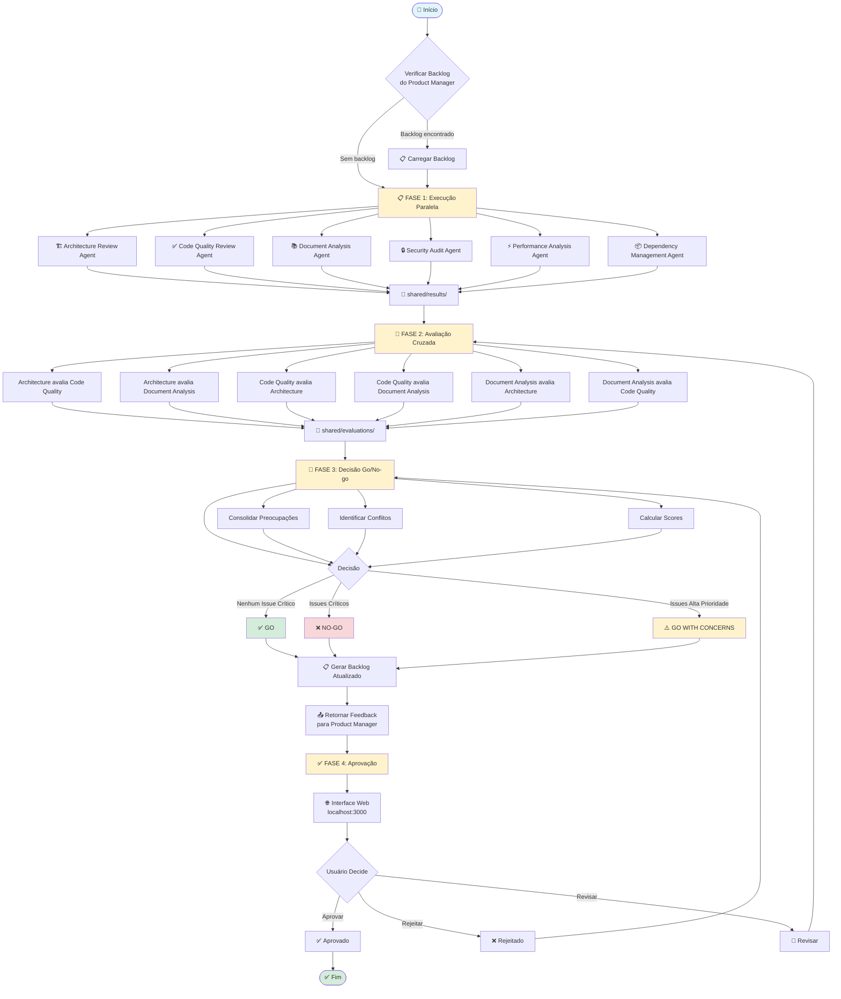

---

### 1.2 Fase 1: Execução Paralela (Detalhada)

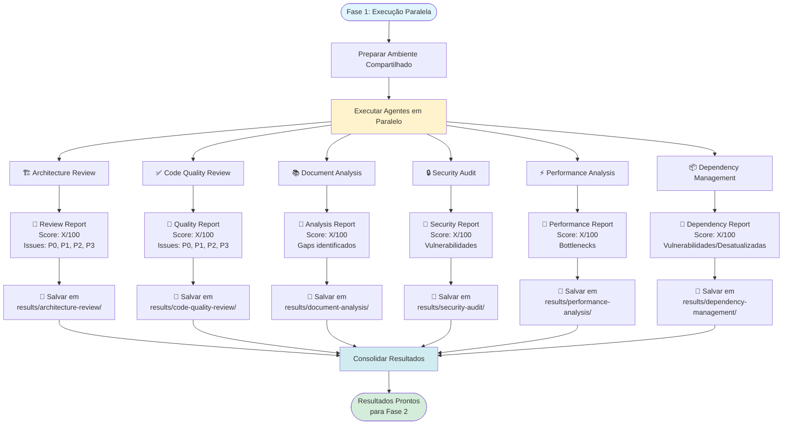

---

### 1.3 Fase 2: Avaliação Cruzada (Detalhada)

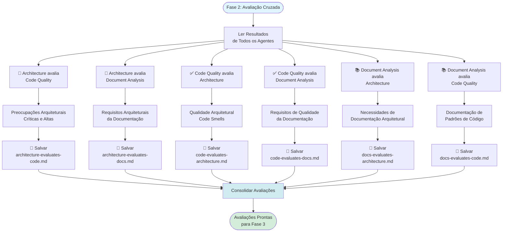

---

## 2. Product Manager Process

### 2.1 Fluxograma Completo

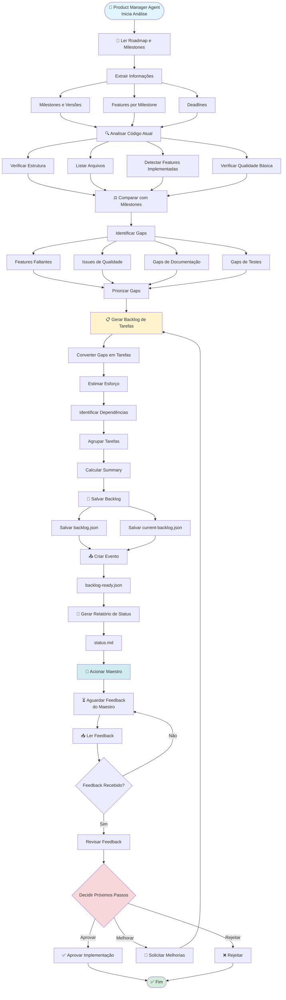

---

### 2.2 Geração de Backlog (Detalhada)

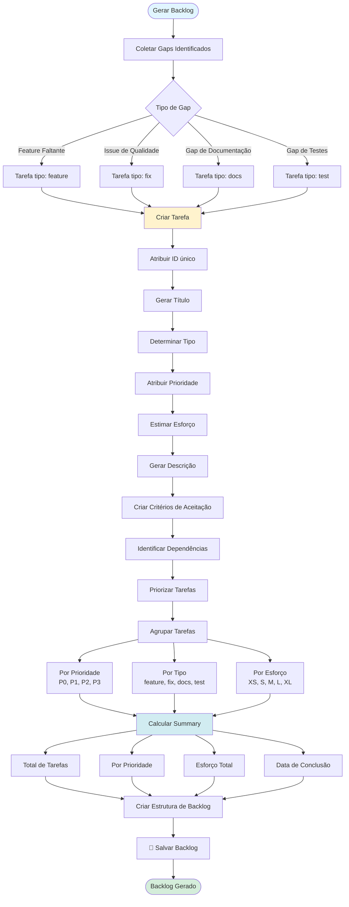

---

## 3. Go/No-go Decision Process

### 3.1 Fluxograma Completo

```mermaid
graph TB
    Start([Fase 3: Decisão Go/No-go]) --> Collect[🔍 Step 1: Coletar Preocupações]
    
    Collect --> ReadAgents[Ler Resultados dos Agentes]
    Collect --> ReadEvals[Ler Avaliações Cruzadas]
    
    ReadAgents --> ArchIssues[Architecture Issues]
    ReadAgents --> CodeIssues[Code Quality Issues]
    ReadAgents --> DocsIssues[Document Analysis Issues]
    ReadAgents --> SecIssues[Security Issues]
    ReadAgents --> PerfIssues[Performance Issues]
    ReadAgents --> DepIssues[Dependency Issues]
    
    ReadEvals --> CrossConcerns[Preocupações das Avaliações]
    
    ArchIssues --> Consolidate[Consolidar Lista]
    CodeIssues --> Consolidate
    DocsIssues --> Consolidate
    SecIssues --> Consolidate
    PerfIssues --> Consolidate
    DepIssues --> Consolidate
    CrossConcerns --> Consolidate
    
    Consolidate --> RemoveDups[Remover Duplicatas]
    RemoveDups --> Categorize[Categorizar por Tipo e Prioridade]
    
    Categorize --> Prioritize[🎯 Step 2: Priorizar]
    
    Prioritize --> CalculateSeverity[Calcular Severidade]
    Prioritize --> CalculateImpact[Calcular Impacto]
    CalculateSeverity --> ApplyMatrix[Aplicar Matriz de Priorização]
    CalculateImpact --> ApplyMatrix
    
    ApplyMatrix --> P0[Issues P0 - Críticos]
    ApplyMatrix --> P1[Issues P1 - Alta]
    ApplyMatrix --> P2[Issues P2 - Média]
    ApplyMatrix --> P3[Issues P3 - Baixa]
    
    P0 --> IdentifyConflicts[⚠️ Step 3: Identificar Conflitos]
    P1 --> IdentifyConflicts
    P2 --> IdentifyConflicts
    P3 --> IdentifyConflicts
    
    IdentifyConflicts --> CompareRecs[Comparar Recomendações]
    CompareRecs --> AnalyzeConflicts[Analisar Cada Conflito]
    AnalyzeConflicts --> ClassifyConflicts[Classificar Conflitos]
    
    ClassifyConflicts --> CalculateScores[📊 Step 4: Calcular Scores]
    
    CalculateScores --> CheckNewAgents{Novos Agentes<br/>Presentes?}
    
    CheckNewAgents -->|Sim| FormulaNew[Fórmula com Novos Agentes<br/>Arch 30% + Code 30% + Docs 15%<br/>+ Security 15% + Perf 5% + Dep 5%]
    CheckNewAgents -->|Não| FormulaOld[Fórmula Original<br/>Arch 40% + Code 40% + Docs 20%]
    
    FormulaNew --> AdjustScores[Ajustar Scores]
    FormulaOld --> AdjustScores
    
    AdjustScores --> ApplyCriteria[🎯 Step 5: Aplicar Critérios]
    
    ApplyCriteria --> CheckNOGO{Verificar<br/>Critérios NO-GO}
    
    CheckNOGO -->|P0 Security| NOGO[❌ NO-GO]
    CheckNOGO -->|P0 Geral| NOGO
    CheckNOGO -->|Bloqueador| NOGO
    CheckNOGO -->|Conflito Bloqueador| NOGO
    CheckNOGO -->|Score < 50| NOGO
    CheckNOGO -->|Nenhum| CheckCONCERNS
    
    CheckCONCERNS{Verificar<br/>Critérios GO WITH CONCERNS} -->|P1 Issues| GOC[⚠️ GO WITH CONCERNS]
    CheckCONCERNS -->|Vulnerabilidades Alta| GOC
    CheckCONCERNS -->|Bottlenecks| GOC
    CheckCONCERNS -->|Dependências Desatualizadas| GOC
    CheckCONCERNS -->|Score 50-74| GOC
    CheckCONCERNS -->|Nenhum| GO
    
    GO[✅ GO]
    
    NOGO --> GenerateReport[📝 Step 6: Gerar Relatório]
    GOC --> GenerateReport
    GO --> GenerateReport
    
    GenerateReport --> ReportFile[go-no-go-report.md]
    
    ReportFile --> GenerateBacklog[📋 Step 7: Gerar Backlog Atualizado]
    
    GenerateBacklog --> ConvertIssues[Converter Issues em Tarefas]
    ConvertIssues --> MergeBacklog{Mesclar com<br/>Backlog Original?}
    
    MergeBacklog -->|Sim| Merge[Mesclar Tarefas]
    MergeBacklog -->|Não| NewBacklog[Criar Novo Backlog]
    
    Merge --> SaveBacklog[💾 Salvar Backlog]
    NewBacklog --> SaveBacklog
    
    SaveBacklog --> ReturnFeedback[📤 Step 8: Retornar Feedback]
    
    ReturnFeedback --> CreateFeedback[workflow-feedback.json]
    CreateFeedback --> RemoveEvent[Remover backlog-ready.json]
    
    RemoveEvent --> End([Decisão Completa])
    
    style Start fill:#e1f5ff
    style End fill:#d4edda
    style NOGO fill:#f8d7da
    style GOC fill:#fff3cd
    style GO fill:#d4edda
    style CalculateScores fill:#d1ecf1
    style GenerateBacklog fill:#fff3cd
```

---

### 3.2 Matriz de Decisão

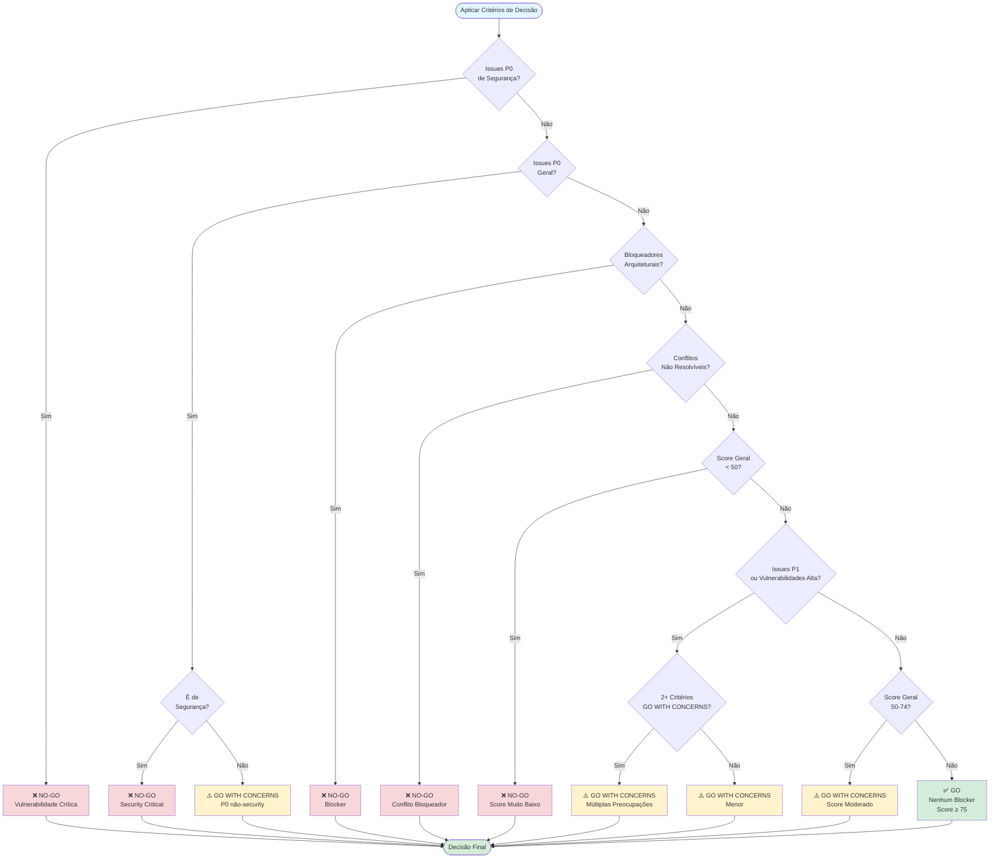

---

## 4. Backlog Generation Process

### 4.1 Fluxograma Completo

```mermaid
graph TB
    Start([Backlog Generation Process]) --> Collect[Step 1: Coletar Issues]
    
    Collect --> FromAgents[Issues dos Agentes]
    Collect --> FromEvals[Issues das Avaliações]
    Collect --> FromDecision[Issues da Decisão]
    
    FromAgents --> ArchIssues[Architecture Issues]
    FromAgents --> CodeIssues[Code Quality Issues]
    FromAgents --> DocsIssues[Document Analysis Issues]
    FromAgents --> SecIssues[Security Issues]
    FromAgents --> PerfIssues[Performance Issues]
    FromAgents --> DepIssues[Dependency Issues]
    
    ArchIssues --> Group[Step 2: Agrupar por Tipo]
    CodeIssues --> Group
    DocsIssues --> Group
    SecIssues --> Group
    PerfIssues --> Group
    DepIssues --> Group
    FromEvals --> Group
    FromDecision --> Group
    
    Group --> SecurityGroup[Security]
    Group --> PerformanceGroup[Performance]
    Group --> CodeQualityGroup[Code Quality]
    Group --> ArchitectureGroup[Architecture]
    Group --> DocumentationGroup[Documentation]
    Group --> TestingGroup[Testing]
    Group --> OtherGroup[Other]
    
    SecurityGroup --> Convert[Step 3: Converter em Tarefas]
    PerformanceGroup --> Convert
    CodeQualityGroup --> Convert
    ArchitectureGroup --> Convert
    DocumentationGroup --> Convert
    TestingGroup --> Convert
    OtherGroup --> Convert
    
    Convert --> GenerateID[Gerar ID único]
    GenerateID --> CreateTitle[Criar Título]
    CreateTitle --> DetermineType[Determinar Tipo]
    DetermineType --> AssignPriority[Atribuir Prioridade]
    AssignPriority --> EstimateEffort[Estimar Esforço]
    EstimateEffort --> GenerateDesc[Gerar Descrição]
    GenerateDesc --> CreateCriteria[Criar Critérios]
    CreateCriteria --> MarkLocation[Marcar Localização]
    MarkLocation --> MarkAgent[Marcar Agente]
    
    MarkAgent --> Prioritize[Step 4: Priorizar Tarefas]
    
    Prioritize --> SortPriority[Ordenar por Prioridade]
    SortPriority --> SortEffort[Ordenar por Esforço]
    
    SortEffort --> IdentifyDeps[Step 5: Identificar Dependências]
    
    IdentifyDeps --> AnalyzeDesc[Analisar Descrições]
    AnalyzeDesc --> FindDeps[Encontrar Dependências]
    FindDeps --> CreateGraph[Criar Grafo de Dependências]
    
    CreateGraph --> GroupTasks[Step 6: Agrupar Tarefas]
    
    GroupTasks --> ByPriority[Por Prioridade<br/>P0, P1, P2, P3]
    GroupTasks --> ByType[Por Tipo<br/>feature, fix, refactor, test, docs]
    GroupTasks --> ByEffort[Por Esforço<br/>XS, S, M, L, XL]
    
    ByPriority --> Calculate[Step 7: Calcular Summary]
    ByType --> Calculate
    ByEffort --> Calculate
    
    Calculate --> TotalTasks[Total de Tarefas]
    Calculate --> ByPriorityCount[Por Prioridade]
    Calculate --> TotalHours[Esforço Total em Horas]
    Calculate --> CompletionDate[Data de Conclusão]
    
    TotalTasks --> CreateStructure[Step 8: Criar Estrutura]
    ByPriorityCount --> CreateStructure
    TotalHours --> CreateStructure
    CompletionDate --> CreateStructure
    
    CreateStructure --> CheckOriginal{Backlog Original<br/>Existe?}
    
    CheckOriginal -->|Sim| Merge[Step 9: Mesclar]
    CheckOriginal -->|Não| NewBacklog[Criar Novo]
    
    Merge --> MergeTasks[Mesclar Tarefas]
    Merge --> KeepId[Manter backlogId Original]
    Merge --> UpdateSummary[Atualizar Summary]
    
    NewBacklog --> Save[Step 10: Salvar Backlog]
    MergeTasks --> Save
    KeepId --> Save
    UpdateSummary --> Save
    
    Save --> SaveJSON[Salvar [backlogId].json]
    Save --> SaveCurrent[Salvar current-backlog.json]
    
    SaveJSON --> End([Backlog Gerado])
    SaveCurrent --> End
    
    style Start fill:#e1f5ff
    style End fill:#d4edda
    style Convert fill:#fff3cd
    style Calculate fill:#d1ecf1
    style Merge fill:#fff3cd
```

---

### 4.2 Conversão de Issues em Tarefas

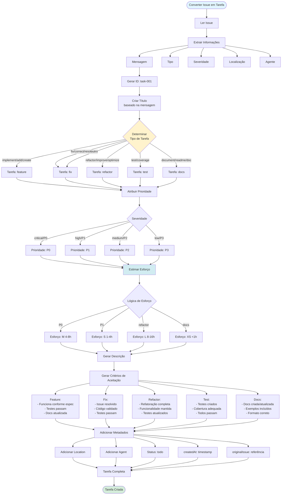

---

## 5. Fluxo Completo Integrado

### 5.1 Workflow End-to-End

```mermaid
graph TB
    Start([🚀 Sistema Maestro Workflow]) --> PM[📊 Product Manager Agent]
    
    PM --> PM1[Ler Roadmap]
    PM1 --> PM2[Analisar Código]
    PM2 --> PM3[Comparar Milestones]
    PM3 --> PM4[Identificar Gaps]
    PM4 --> PM5[Gerar Backlog]
    PM5 --> PM6[Salvar Backlog]
    PM6 --> PM7[Criar Evento backlog-ready.json]
    
    PM7 --> Maestro[🎭 Maestro Detecta Evento]
    
    Maestro --> CheckBacklog{Backlog<br/>Disponível?}
    
    CheckBacklog -->|Sim| LoadBacklog[Carregar Backlog]
    CheckBacklog -->|Não| Phase1
    
    LoadBacklog --> Phase1[📋 FASE 1: Execução Paralela]
    
    Phase1 --> Agents[6 Agentes Executam]
    Agents --> Results[Resultados Salvos]
    
    Results --> Phase2[🔄 FASE 2: Avaliação Cruzada]
    
    Phase2 --> Evals[6 Avaliações Cruzadas]
    Evals --> EvalResults[Avaliações Salvas]
    
    EvalResults --> Phase3[🎯 FASE 3: Decisão Go/No-go]
    
    Phase3 --> Consolidate[Consolidar Preocupações]
    Phase3 --> Conflicts[Identificar Conflitos]
    Phase3 --> Scores[Calcular Scores]
    Phase3 --> Decision{Decisão}
    
    Consolidate --> Decision
    Conflicts --> Decision
    Scores --> Decision
    
    Decision -->|GO| GO[✅ GO]
    Decision -->|NO-GO| NOGO[❌ NO-GO]
    Decision -->|GO WITH CONCERNS| GOC[⚠️ GO WITH CONCERNS]
    
    GO --> BacklogGen[📋 Gerar Backlog Atualizado]
    NOGO --> BacklogGen
    GOC --> BacklogGen
    
    BacklogGen --> BacklogGen1[Converter Issues em Tarefas]
    BacklogGen1 --> BacklogGen2[Priorizar Tarefas]
    BacklogGen2 --> BacklogGen3[Calcular Summary]
    BacklogGen3 --> BacklogGen4[Salvar Backlog]
    
    BacklogGen4 --> Feedback[📤 Retornar Feedback]
    
    Feedback --> Feedback1[Criar workflow-feedback.json]
    Feedback1 --> Feedback2[Incluir Decisão, Scores, Issues]
    Feedback2 --> Feedback3[Incluir Backlog Atualizado]
    
    Feedback3 --> Phase4[✅ FASE 4: Aprovação]
    
    Phase4 --> WebUI[🌐 Interface Web]
    WebUI --> User{Usuário<br/>Aprova?}
    
    User -->|Aprovar| Approved[✅ Aprovado]
    User -->|Rejeitar| Rejected[❌ Rejeitado]
    User -->|Revisar| Review[🔄 Revisar]
    
    Approved --> PMRead[Product Manager Lê Feedback]
    Rejected --> Phase3
    Review --> Phase2
    
    PMRead --> PMDecision{Product Manager<br/>Decide}
    
    PMDecision -->|Aprovar| Implement[🛠️ Implementar Tarefas]
    PMDecision -->|Melhorar| PM4
    PMDecision -->|Rejeitar| End
    
    Implement --> End([✅ Fim do Workflow])
    
    style Start fill:#e1f5ff
    style End fill:#d4edda
    style PM fill:#d1ecf1
    style Maestro fill:#fff3cd
    style Phase1 fill:#fff3cd
    style Phase2 fill:#fff3cd
    style Phase3 fill:#fff3cd
    style Phase4 fill:#fff3cd
    style GO fill:#d4edda
    style NOGO fill:#f8d7da
    style GOC fill:#fff3cd
    style BacklogGen fill:#d1ecf1
    style Feedback fill:#d1ecf1
```

---

### 5.2 Fluxo de Dados

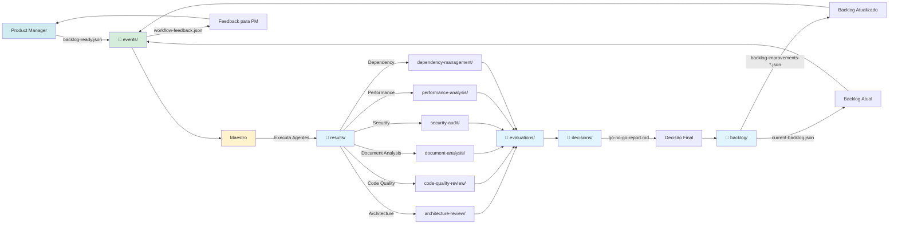

---

### 5.3 Ciclo de Vida Completo

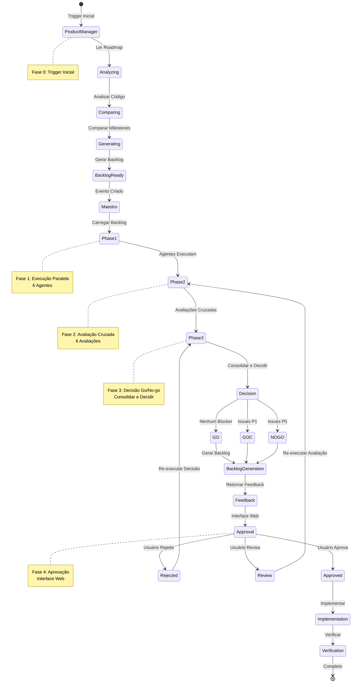

---

## 📊 Legenda de Cores

### Status dos Componentes

- 🟢 **Verde**: Processo completo e funcional
- 🟡 **Amarelo**: Processo em execução ou pendente
- 🔴 **Vermelho**: Bloqueador ou erro
- 🔵 **Azul**: Informação ou dados

### Tipos de Nós

- **Retângulo Arredondado**: Início/Fim
- **Retângulo**: Processo/Ação
- **Losango**: Decisão/Condição
- **Cilindro**: Dados/Arquivo
- **Paralelogramo**: Entrada/Saída

---

## 🔗 Referências

- [Workflow Execution Process](processes/workflow-execution.md)
- [Product Manager Process](processes/product-manager.md)
- [Go/No-go Decision Process](processes/go-no-go-decision.md)
- [Backlog Generation Process](processes/backlog-generation.md)
- [Process Review](PROCESS_REVIEW.md)
- [Process Mapping](PROCESS_MAPPING.md)

---

## 📝 Notas

### Sobre os Diagramas

1. **Mermaid Syntax**: Todos os diagramas usam sintaxe Mermaid válida
2. **Atualização**: Diagramas refletem a implementação atual (v2.0)
3. **Novos Agentes**: Security, Performance e Dependency incluídos
4. **Fase 0**: Product Manager Agent incluído como trigger inicial
5. **Backlog Generator**: Processo completo documentado

### Como Usar

1. **Visualização**: Use um renderizador Mermaid (GitHub, VS Code, etc.)
2. **Edição**: Edite diretamente o código Mermaid
3. **Exportação**: Exporte como PNG/SVG usando ferramentas Mermaid

---

**Última Atualização:** 2025-12-30  
**Versão:** 2.0  
**Status:** ✅ Completo e Atualizado

