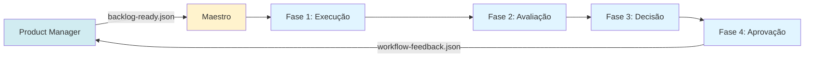
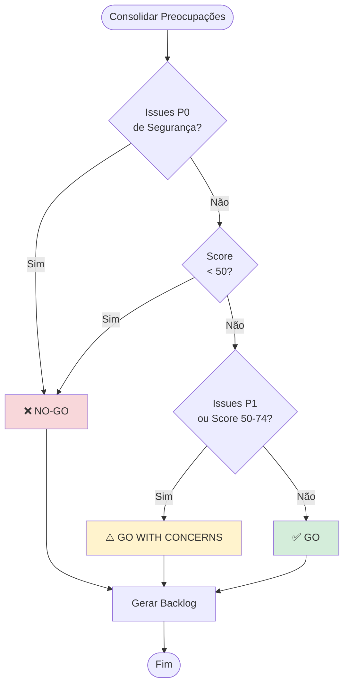
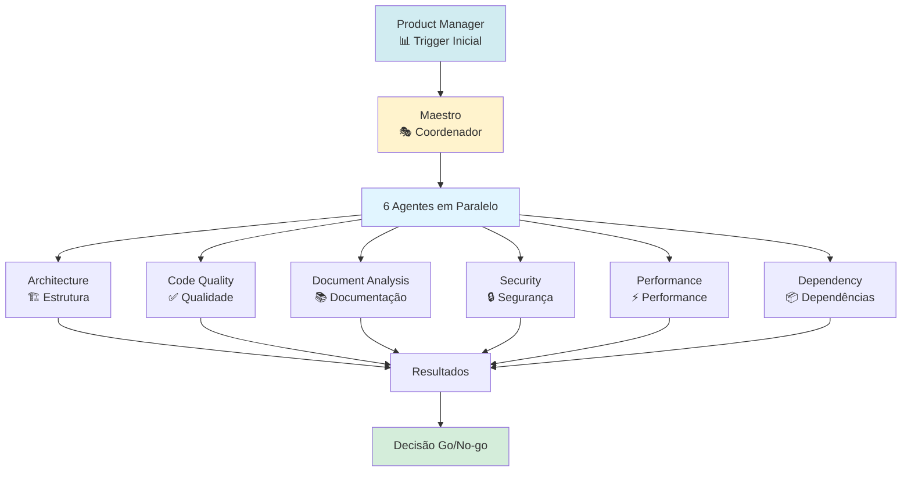
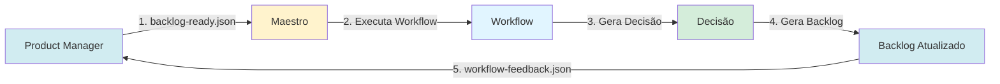
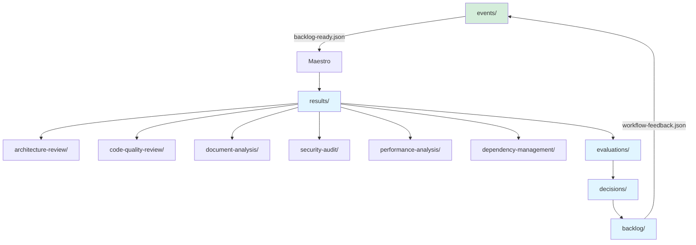

# 🚀 Quick Reference - Flowcharts Essenciais

**Versão:** 2.0  
**Última Atualização:** 2025-12-30

---

## 📋 Visão Rápida

Este documento contém os flowcharts essenciais para entendimento rápido do sistema Maestro Workflow.

Para flowcharts detalhados, consulte [PROCESS_FLOWCHARTS.md](PROCESS_FLOWCHARTS.md).

---

## 🔄 Fluxo Principal Simplificado

---

## 🎯 Decisão Go/No-go (Simplificada)

---

## 📊 Agentes e Suas Funções

---

## 🔄 Ciclo de Feedback

---

## 📁 Estrutura de Dados

---

**Para flowcharts detalhados, consulte:** [PROCESS_FLOWCHARTS.md](PROCESS_FLOWCHARTS.md)

