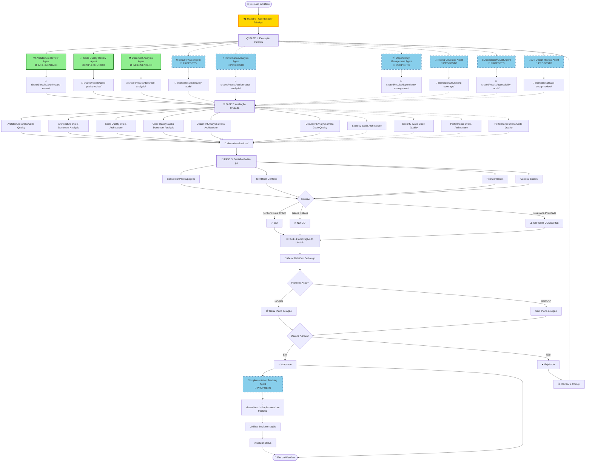
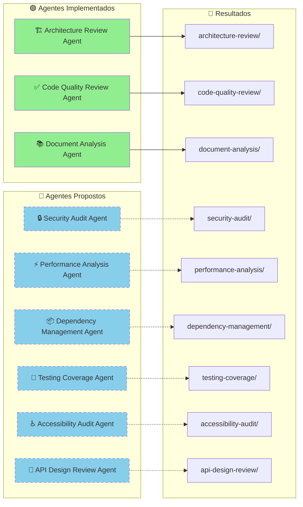
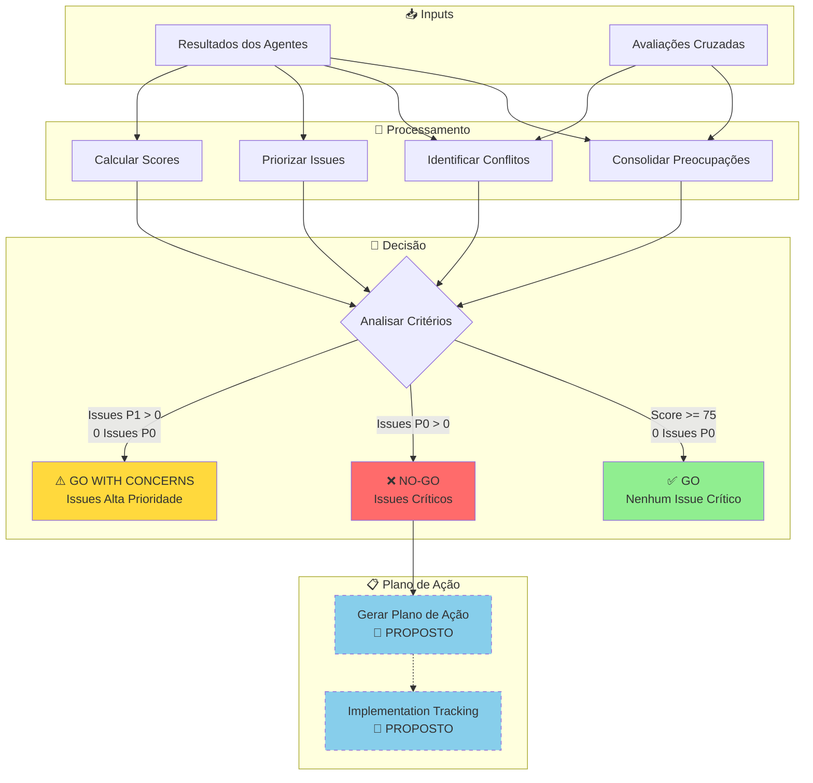
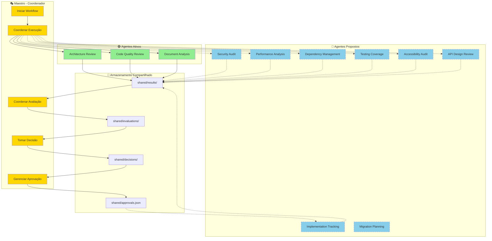
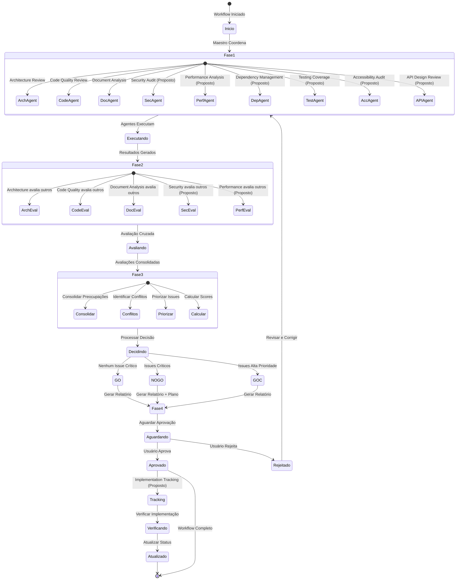

# 🔄 Fluxograma Detalhado - Maestro Workflow

**Data:** 2025-12-30T17:45:00.000Z
**Coordenador:** Maestro - Sistema de Coordenação
**Versão:** 2.0

---

## 📊 Legenda

- 🟢 **Verde**: Agentes Implementados e Ativos
- 🔵 **Azul**: Novos Agentes Propostos (Aguardando Implementação)
- ⚪ **Branco**: Componentes do Sistema Maestro

---

## 🔄 Fluxograma Principal

---

## 📋 Fluxograma Detalhado por Fase

### FASE 1: Execução Paralela - Detalhada

---

### FASE 2: Avaliação Cruzada - Detalhada

```mermaid
graph TB
    subgraph "📊 Resultados da Fase 1"
        R1[Architecture Results]
        R2[Code Quality Results]
        R3[Document Analysis Results]
        R4[Security Results]
        R5[Performance Results]
    end
    
    subgraph "🔄 Avaliações Cruzadas - Implementadas"
        E1[Architecture → Code Quality]
        E2[Architecture → Document Analysis]
        E3[Code Quality → Architecture]
        E4[Code Quality → Document Analysis]
        E5[Document Analysis → Architecture]
        E6[Document Analysis → Code Quality]
    end
    
    subgraph "🔄 Avaliações Cruzadas - Propostas"
        E7[Security → Architecture]
        E8[Security → Code Quality]
        E9[Performance → Architecture]
        E10[Performance → Code Quality]
        E11[Testing → Code Quality]
        E12[Accessibility → Code Quality]
    end
    
    R1 --> E1
    R2 --> E1
    R1 --> E2
    R3 --> E2
    R2 --> E3
    R1 --> E3
    R2 --> E4
    R3 --> E4
    R3 --> E5
    R1 --> E5
    R3 --> E6
    R2 --> E6
    
    R4 -.-> E7
    R1 -.-> E7
    R4 -.-> E8
    R2 -.-> E8
    R5 -.-> E9
    R1 -.-> E9
    R5 -.-> E10
    R2 -.-> E10
    
    E1 --> Evals[📁 shared/evaluations/]
    E2 --> Evals
    E3 --> Evals
    E4 --> Evals
    E5 --> Evals
    E6 --> Evals
    E7 -.-> Evals
    E8 -.-> Evals
    E9 -.-> Evals
    E10 -.-> Evals
    E11 -.-> Evals
    E12 -.-> Evals
    
    style E1 fill:#90EE90
    style E2 fill:#90EE90
    style E3 fill:#90EE90
    style E4 fill:#90EE90
    style E5 fill:#90EE90
    style E6 fill:#90EE90
    style E7 fill:#87CEEB,stroke-dasharray: 5 5
    style E8 fill:#87CEEB,stroke-dasharray: 5 5
    style E9 fill:#87CEEB,stroke-dasharray: 5 5
    style E10 fill:#87CEEB,stroke-dasharray: 5 5
    style E11 fill:#87CEEB,stroke-dasharray: 5 5
    style E12 fill:#87CEEB,stroke-dasharray: 5 5
```

---

### FASE 3: Decisão Go/No-go - Detalhada

---

## 🔄 Fluxo de Dados Completo

---

## 📊 Tabela de Status dos Agentes

| Agente | Status | Fase de Execução | Prioridade | Impacto na Decisão |
|--------|--------|------------------|------------|-------------------|
| 🏗️ Architecture Review | 🟢 Implementado | Fase 1 | - | P0/P1 |
| ✅ Code Quality Review | 🟢 Implementado | Fase 1 | - | P0/P1 |
| 📚 Document Analysis | 🟢 Implementado | Fase 1 | - | P0/P1 |
| 🔒 Security Audit | 🔵 Proposto | Fase 1 | Alta | P0 (crítico) |
| ⚡ Performance Analysis | 🔵 Proposto | Fase 1 | Média | P1 |
| 📦 Dependency Management | 🔵 Proposto | Fase 1 | Alta | P0 (vulnerabilidades) |
| 🧪 Testing Coverage | 🔵 Proposto | Fase 1 | Média | P0 (código crítico) |
| ♿ Accessibility Audit | 🔵 Proposto | Fase 1 | Média | P1 |
| 🔌 API Design Review | 🔵 Proposto | Fase 1 | Baixa | P1 |
| 🔄 Implementation Tracking | 🔵 Proposto | Pós-Aprovação | Alta | Monitoramento |
| 🔄 Migration Planning | 🔵 Proposto | Sob Demanda | Baixa | Planejamento |

---

## 🔄 Ciclo de Vida Completo

---

## 📋 Checklist de Integração

### Para Agentes Implementados ✅

- [x] Architecture Review Agent integrado
- [x] Code Quality Review Agent integrado
- [x] Document Analysis Agent integrado
- [x] Avaliação cruzada funcionando
- [x] Decisão Go/No-go funcionando
- [x] Sistema de aprovação funcionando

### Para Agentes Propostos 🔵

- [ ] Security Audit Agent - Estrutura criada
- [ ] Security Audit Agent - Script implementado
- [ ] Security Audit Agent - Integrado ao workflow
- [ ] Performance Analysis Agent - Estrutura criada
- [ ] Performance Analysis Agent - Script implementado
- [ ] Performance Analysis Agent - Integrado ao workflow
- [ ] Dependency Management Agent - Estrutura criada
- [ ] Dependency Management Agent - Script implementado
- [ ] Dependency Management Agent - Integrado ao workflow
- [ ] Testing Coverage Agent - Estrutura criada
- [ ] Testing Coverage Agent - Script implementado
- [ ] Testing Coverage Agent - Integrado ao workflow
- [ ] Accessibility Audit Agent - Estrutura criada
- [ ] Accessibility Audit Agent - Script implementado
- [ ] Accessibility Audit Agent - Integrado ao workflow
- [ ] API Design Review Agent - Estrutura criada
- [ ] API Design Review Agent - Script implementado
- [ ] API Design Review Agent - Integrado ao workflow
- [ ] Implementation Tracking Agent - Estrutura criada
- [ ] Implementation Tracking Agent - Script implementado
- [ ] Implementation Tracking Agent - Integrado ao workflow
- [ ] Migration Planning Agent - Estrutura criada
- [ ] Migration Planning Agent - Script implementado
- [ ] Migration Planning Agent - Integrado ao workflow

---

## 🎯 Próximos Passos de Implementação

1. **Priorizar Agentes**
   - Implementar Security Audit Agent (Alta Prioridade)
   - Implementar Dependency Management Agent (Alta Prioridade)
   - Implementar Implementation Tracking Agent (Alta Prioridade)

2. **Criar Estrutura**
   - Criar diretórios para cada agente
   - Criar scripts de execução
   - Criar processos e checklists

3. **Integrar com Maestro**
   - Adicionar ao `run-workflow.js`
   - Adicionar avaliações cruzadas
   - Atualizar lógica de decisão

4. **Testar e Validar**
   - Testar cada agente isoladamente
   - Testar integração completa
   - Validar outputs e decisões

---

**Gerado por:** Maestro - Coordenador Principal
**Versão:** 2.0
**Última Atualização:** 2025-12-30

