# 🗺️ Sitemap Visual - Sistema Factory

**Mapa visual completo da documentação (46 páginas)**

---

## 📊 Diagrama de Estrutura

```mermaid
graph TD
    HOME[🏠 Home] --> GETTING[🚀 Getting Started]
    
    HOME --> ORG[🏛️ Estrutura Organizacional]
    ORG --> ORG_OV[Overview]
    ORG --> ORG_HIER[Hierarquia]
    ORG --> ORG_ROLES[Papéis]
    
    ORG_ROLES --> FM[Factory Manager]
    ORG_ROLES --> PM[Product Manager]
    ORG_ROLES --> IA[Implementation Agent]
    ORG_ROLES --> TA[Test Agent]
    ORG_ROLES --> DA[Doc Analyst]
    
    HOME --> DEPT[🏢 Departamentos]
    DEPT --> DEPT_OV[Overview]
    DEPT --> DEPT_CAT[Categories]
    DEPT --> DEPT_ARCH[Architecture]
    DEPT --> DEPT_QUAL[Code Quality]
    DEPT --> DEPT_TEST[Testing]
    DEPT --> DEPT_DOC[Documentation]
    DEPT --> DEPT_PERF[Performance]
    DEPT --> DEPT_SEC[Security]
    DEPT --> DEPT_REL[Reliability]
    DEPT --> DEPT_PROD[Product]
    DEPT --> DEPT_IMPL[Implementation]
    DEPT --> DEPT_AI[AI Agents]
    DEPT --> DEPT_REV[Review]
    DEPT --> DEPT_OPS[Operations]
    DEPT --> DEPT_GOV[Governance]
    
    HOME --> PROC[🔁 Processos]
    PROC --> PROC_OV[Overview]
    PROC --> PROC_FLOW[Full Flow]
    PROC --> PROC_IN[Inputs]
    PROC --> PROC_OUT[Outputs]
    PROC --> PROC_RACI[RACI]
    PROC --> PROC_CHECK[Checklists]
    PROC --> PROC_CRIT[Criteria]
    PROC --> PROC_PHASES[Fases]
    
    PROC_PHASES --> P1[Phase 1]
    PROC_PHASES --> P2[Phase 2]
    PROC_PHASES --> P3[Phase 3]
    PROC_PHASES --> P4[Phase 4]
    
    HOME --> INFRA[🧩 Infraestrutura]
    INFRA --> INFRA_OV[Overview]
    INFRA --> INFRA_TECH[Tech Stack]
    INFRA --> INFRA_REPO[Repo Structure]
    INFRA --> INFRA_BRANCH[Branching]
    INFRA --> INFRA_NAMING[Naming]
    INFRA --> INFRA_DOC[Doc Standards]
    INFRA --> INFRA_CI[CI/CD]
    
    HOME --> GOV[🧭 Governança]
    GOV --> GOV_OV[Overview]
    GOV --> GOV_DEC[Decision Rights]
    GOV --> GOV_CER[Cerimonies]
    GOV --> GOV_QUAL[Quality Gates]
    GOV --> GOV_REV[Review Cycles]
    
    HOME --> CULT[🌱 Cultura]
    CULT --> CULT_PRIN[Principles]
    CULT --> CULT_WORK[How We Work]
    CULT --> CULT_BEH[Behavioral]
    CULT --> CULT_ANTI[Anti-patterns]
    CULT --> CULT_COMM[Communication]
    
    HOME --> GLOSS[📚 Glossário]
    GLOSS --> GLOSS_TERMS[Terms]
    GLOSS --> GLOSS_ACRO[Acronyms]
    GLOSS --> GLOSS_TEMP[Templates]
    GLOSS --> GLOSS_REF[References]
    
    style HOME fill:#667eea,stroke:#764ba2,color:#fff
    style ORG fill:#818cf8,stroke:#667eea,color:#fff
    style DEPT fill:#10b981,stroke:#059669,color:#fff
    style PROC fill:#f59e0b,stroke:#d97706,color:#fff
    style INFRA fill:#3b82f6,stroke:#2563eb,color:#fff
    style GOV fill:#8b5cf6,stroke:#7c3aed,color:#fff
    style CULT fill:#ec4899,stroke:#db2777,color:#fff
    style GLOSS fill:#6b7280,stroke:#4b5563,color:#fff
```



---

## 📋 Lista Completa de Páginas (46)

### 1. Home / Getting Started (2 páginas)
1. ✅ `index.md` - Home
2. ✅ `getting-started.md` - Getting Started

### 2. Estrutura Organizacional (7 páginas)
3. ✅ `org/overview.md`
4. ✅ `org/hierarchy.md`
5. ✅ `org/roles/factory-manager.md`
6. ✅ `org/roles/product-manager.md`
7. ✅ `org/roles/impl-agent.md`
8. ✅ `org/roles/test-agent.md`
9. ✅ `org/roles/doc-analyst.md`

### 3. Departamentos (15 páginas)
10. ✅ `departments/overview.md`
11. ✅ `departments/categories.md`
12. ✅ `departments/architecture.md`
13. ✅ `departments/code-quality.md`
14. ✅ `departments/testing.md`
15. ✅ `departments/documentation.md`
16. ✅ `departments/performance.md`
17. ✅ `departments/security.md`
18. ✅ `departments/reliability.md`
19. ✅ `departments/product.md`
20. ✅ `departments/implementation.md`
21. ✅ `departments/ai-agents.md`
22. ✅ `departments/review.md`
23. ✅ `departments/operations.md`
24. ✅ `departments/governance.md`

### 4. Processos Organizacionais (10 páginas)
25. ✅ `processes/overview.md`
26. ✅ `processes/full-flow.md`
27. ✅ `processes/inputs.md`
28. ✅ `processes/outputs.md`
29. ✅ `processes/raci.md`
30. ✅ `processes/checklists.md`
31. ✅ `processes/criteria.md`
32. ✅ `processes/phases/phase-1.md`
33. ✅ `processes/phases/phase-2.md`
34. ✅ `processes/phases/phase-3.md`
35. ✅ `processes/phases/phase-4.md`

### 5. Infraestrutura (7 páginas)
36. ✅ `infra/overview.md`
37. ✅ `infra/tech-stack.md`
38. ✅ `infra/repo-structure.md`
39. ✅ `infra/branching.md`
40. ✅ `infra/naming-conventions.md`
41. ✅ `infra/documentation-standard.md`
42. ✅ `infra/ci-cd.md`

### 6. Governança (5 páginas)
43. ✅ `governance/overview.md`
44. ✅ `governance/decision-rights.md`
45. ✅ `governance/cerimonies.md`
46. ✅ `governance/quality-gates.md`
47. ✅ `governance/review-cycles.md`

### 7. Cultura (5 páginas)
48. ✅ `culture/principles.md`
49. ✅ `culture/how-we-work.md`
50. ✅ `culture/behavioral.md`
51. ✅ `culture/anti-patterns.md`
52. ✅ `culture/communication.md`

### 8. Glossário (4 páginas)
53. ✅ `glossary/terms.md`
54. ✅ `glossary/acronyms.md`
55. ✅ `glossary/templates.md`
56. ✅ `glossary/references.md`

---

## 📊 Estatísticas

| Categoria | Páginas | % do Total |
|-----------|---------|------------|
| Home / Getting Started | 2 | 4.3% |
| Estrutura Organizacional | 7 | 15.2% |
| Departamentos | 15 | 32.6% |
| Processos | 10 | 21.7% |
| Infraestrutura | 7 | 15.2% |
| Governança | 5 | 10.9% |
| Cultura | 5 | 10.9% |
| Glossário | 4 | 8.7% |
| **TOTAL** | **46** | **100%** |

---

## 🔗 Relacionamentos Principais

### Fluxo de Dependências

```
Home
  ├── Getting Started
  │
  ├── Estrutura Organizacional
  │   ├── Overview
  │   ├── Hierarchy
  │   └── Roles → Departamentos
  │
  ├── Departamentos
  │   └── Cada dept → Processos relacionados
  │
  ├── Processos
  │   └── Cada processo → Departamentos envolvidos
  │
  ├── Infraestrutura
  │   └── Suporta todos os departamentos
  │
  ├── Governança
  │   └── Controla processos e departamentos
  │
  ├── Cultura
  │   └── Influencia tudo
  │
  └── Glossário
      └── Referência para todos
```

---

## 🎯 Navegação Rápida

### Por Tipo de Usuário

**👔 Liderança:**
- Org Overview → Hierarchy → Governance → Decision Rights

**🏗️ Arquitetos:**
- Departments → Architecture → Infra → Tech Stack

**👨‍💻 Desenvolvedores:**
- Departments → Code Quality → Infra → Naming Conventions

**📋 Product Managers:**
- Roles → Product Manager → Departments → Product → Processes

**🧪 QA:**
- Departments → Testing → Processes → Checklists → Quality Gates

---

**Última atualização:** 1 de Janeiro de 2026

