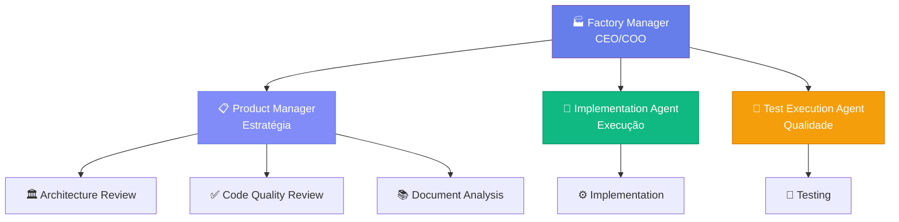

# 👔 Hierarquia Executiva

**Data:** 1 de Janeiro de 2026  
**Versão:** 1.0

---

## 🎯 Organograma Executivo

---

## 🏭 Factory Manager - CEO/COO

**Responsabilidades:**
- Orquestração estratégica de todos os departamentos
- Coordenação de projetos multi-disciplinares
- Tomada de decisão final (Go/No-go)
- Garantia de qualidade e consistência
- Comunicação com stakeholders externos

**Características:**
- Visão 360° do negócio
- Decisões baseadas em dados consolidados
- Foco em eficiência e paralelização
- Liderança facilitadora (não micro-gerenciadora)

[Ver Detalhes Completos →](./roles/factory-manager.md)

---

## 📋 Product Manager

**Responsabilidades:**
- Análise de roadmap e backlog
- Priorização de features
- Definição de escopo de projetos
- Interface com stakeholders

[Ver Detalhes Completos →](./roles/product-manager.md)

---

## 🔄 Implementation Agent

**Responsabilidades:**
- Execução de correções automáticas
- Implementação de melhorias
- Aplicação de fixes
- Automação de tarefas repetitivas

[Ver Detalhes Completos →](./roles/impl-agent.md)

---

## 🧪 Test Execution Agent

**Responsabilidades:**
- Orquestração de testes
- Execução de test suites
- Quality gates
- Relatórios de testes

[Ver Detalhes Completos →](./roles/test-agent.md)

---

## 🔗 Links Relacionados

- [Visão Geral Organizacional](./overview.md)
- [Factory Manager - Detalhes](./roles/factory-manager.md)
- [Product Manager - Detalhes](./roles/product-manager.md)
- [Departamentos](../departments/overview.md)
- [Governança](../governance/overview.md)

---

**Última atualização:** 1 de Janeiro de 2026

