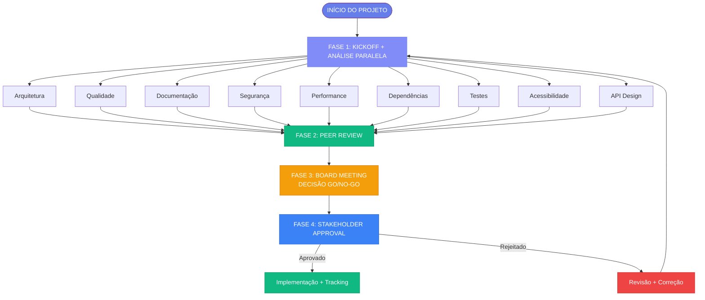

# 🔄 Fluxo Completo de Processos

**Data:** 1 de Janeiro de 2026  
**Versão:** 1.0

---

## 🎯 Visão Geral

Este documento apresenta o fluxo completo dos processos organizacionais do Sistema Factory, desde o início do projeto até a implementação final.

---

## 🔄 Diagrama de Fluxo

---

## 📋 Fases do Processo

### Fase 1: Execução Paralela
**Duração:** 1-2 semanas  
**Descrição:** Todos os departamentos trabalham simultaneamente

[Ver Detalhes →](./phases/phase-1.md)

### Fase 2: Revisões Especializadas
**Duração:** 3-5 dias  
**Descrição:** Peer review entre departamentos

[Ver Detalhes →](./phases/phase-2.md)

### Fase 3: Documentação
**Duração:** Variável  
**Descrição:** Consolidação e documentação

[Ver Detalhes →](./phases/phase-3.md)

### Fase 4: Aprovação Final
**Duração:** 1-2 dias  
**Descrição:** Decisão Go/No-go e aprovação

[Ver Detalhes →](./phases/phase-4.md)

---

## 🔗 Links Relacionados

- [Visão Geral dos Processos](./overview.md)
- [Inputs do Processo](./inputs.md)
- [Outputs do Processo](./outputs.md)
- [Matriz RACI](./raci.md)

---

**Última atualização:** 1 de Janeiro de 2026

