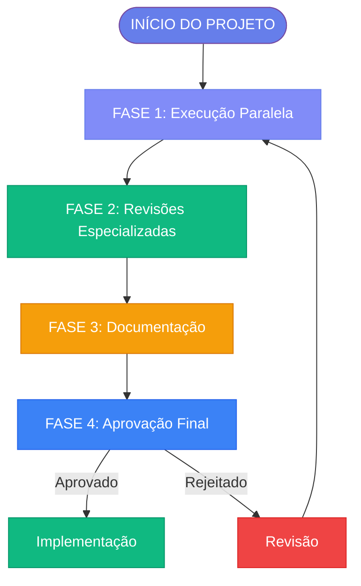

# 🔁 Visão Geral - Processos Organizacionais

**Data:** 1 de Janeiro de 2026  
**Versão:** 1.0

---

## 🎯 Visão Geral

O Sistema Factory opera através de **4 fases principais** de processos organizacionais, desde a execução paralela inicial até a aprovação final. Este documento apresenta uma visão geral de todo o fluxo.

---

## 🔄 Fluxo Completo

[Ver Fluxo Completo →](./full-flow.md)

---

## 📋 Fases do Processo

### Fase 1: Execução Paralela
**Duração:** 1-2 semanas  
**Descrição:** Todos os departamentos trabalham simultaneamente na análise inicial

[Ver Detalhes →](./phases/phase-1.md)

### Fase 2: Revisões Especializadas
**Duração:** 3-5 dias  
**Descrição:** Cada departamento avalia os resultados dos outros (peer review)

[Ver Detalhes →](./phases/phase-2.md)

### Fase 3: Documentação
**Duração:** Variável  
**Descrição:** Consolidação de documentação e relatórios

[Ver Detalhes →](./phases/phase-3.md)

### Fase 4: Aprovação Final
**Duração:** 1-2 dias  
**Descrição:** Decisão Go/No-go e aprovação de stakeholders

[Ver Detalhes →](./phases/phase-4.md)

---

## 📥 Inputs e Outputs

### Inputs
- Requisitos do projeto
- Código fonte
- Documentação existente
- Histórico de decisões

[Ver Inputs Completos →](./inputs.md)

### Outputs
- Relatórios de análise
- Recomendações
- Decisões Go/No-go
- Documentação consolidada

[Ver Outputs Completos →](./outputs.md)

---

## 📊 Matriz RACI

Cada processo tem responsabilidades claramente definidas através da matriz RACI:
- **R**esponsible
- **A**ccountable
- **C**onsulted
- **I**nformed

[Ver Matriz RACI Completa →](./raci.md)

---

## ✅ Checklists

Cada fase possui checklists específicos para garantir completude:

[Ver Checklists →](./checklists.md)

---

## 🎯 Critérios de Decisão

Critérios claros para tomada de decisão em cada fase:

[Ver Critérios →](./criteria.md)

---

## 🔗 Links Relacionados

- [Fluxo Completo](./full-flow.md)
- [Fase 1: Execução Paralela](./phases/phase-1.md)
- [Fase 2: Revisões Especializadas](./phases/phase-2.md)
- [Fase 3: Documentação](./phases/phase-3.md)
- [Fase 4: Aprovação Final](./phases/phase-4.md)
- [Governança](../governance/overview.md)

---

**Última atualização:** 1 de Janeiro de 2026

